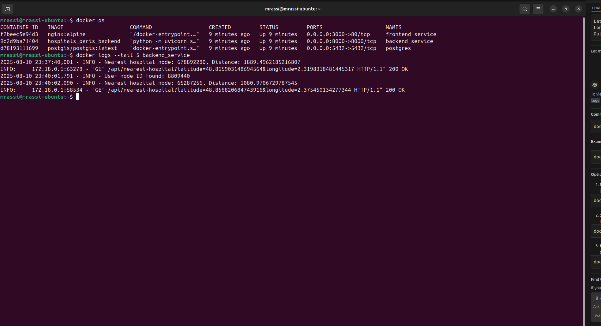
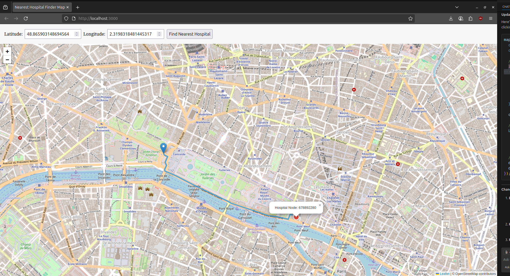
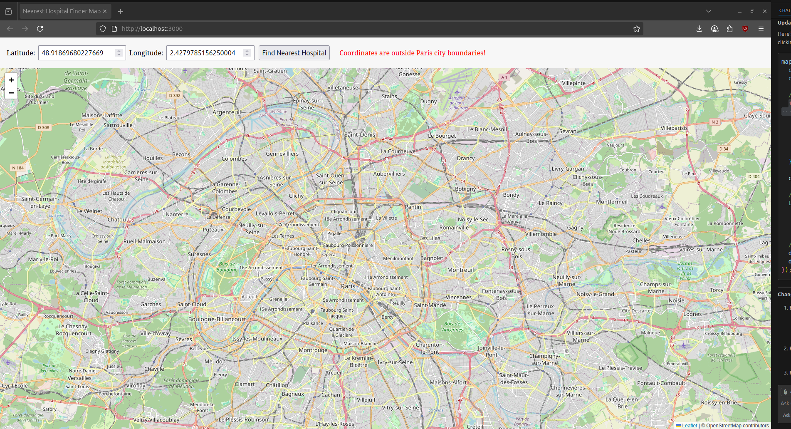

# Nearest Hospital Finder

This project enables users to click anywhere on a map (within Paris) and find the shortest driving path to the nearest hospital, calculated approximately from the selected point.

This project consists of three main services:

### 1. Database Service
- **Image:** [PostGIS](https://hub.docker.com/r/postgis/postgis/)
- **Schema:** See `data/init.sql`
  - **network_nodes:** Road network nodes (intersections/points), with latitude, longitude, geometry, and optional street count.
  - **network_edges:** Directed edges between nodes representing road segments, with geometry and length.
  - **network_hospitals:** Hospital locations as nodes, with geometry.

### 2. Backend Service (FastAPI)
- **Pre-launch step:** Use the `OsmDataManager` (`app/db/osmDataManager`) to fetch, validate, transform, and load OSM data into PostGIS.
- **Router:** `/nearest-hospital`
  - **Input:** Latitude and longitude within Paris boundaries.
  - **Output:** GeoJSON containing the path to the nearest hospital.
- **Algorithms:** Pure Python Dijkstra implementation in `services/algorithms` (for fun, without relying on PostGIS functions or libraries like NetworkX).

### 3. Frontend Service
- **User Interaction:** Click anywhere within Paris boundaries to query the backend and visualize the shortest path to the nearest hospital.
## Quick Start Guide

Follow these steps to get the application up and running:

### 1. Clone the Repository

```sh
git clone git@github.com:mrassiyacine/hospitals_paris.git
cd hospitals_paris
```

### 2. Configure Environment Variables

Create a `.env` file in the project root to set up environment variables for the backend and database connections.  
Example `.env` contents:

```env
POSTGRES_HOST=localhost
POSTGRES_PORT=5432
POSTGRES_DB=postgres
POSTGRES_USER=postgres
POSTGRES_PASSWORD=postgres
```

Update these values as needed for your local setup or Docker environment.

### 3. Start All Services

```sh
docker-compose up
```

*Note: Make sure that PostGIS and backend services are initialized and populated before using the frontend.*

### 4. Access the Application

Open your browser and go to [http://localhost:3000](http://localhost:3000).

### 5. Using the App

Click anywhere within Paris boundaries on the map to find and display the shortest driving path to the nearest hospital.

## Screenshots

Below are some example screenshots of the app in action:


*Service/containers running.*



*Shortest path to nearest hospital displayed on the map.*



* Clicked location outside Paris boundaries*